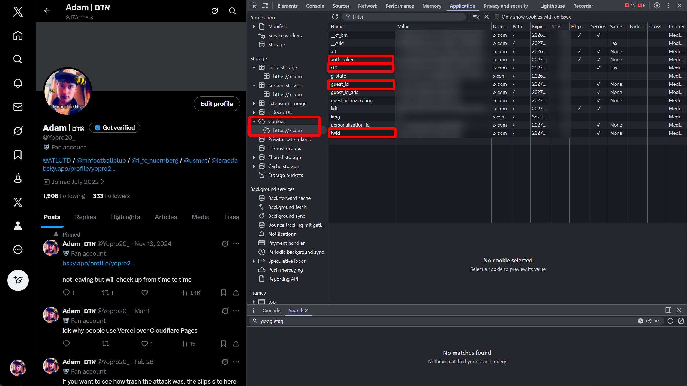

Log in to Twitter in your browser, open DevTools > Application > Cookies > x.com, and copy `auth_token`, `ct0`, `guest_id`, and `twid` into your `.env` as `TWITTER_AUTH_TOKEN`, `TWITTER_CT0`, `TWITTER_GUEST_ID`, `TWITTER_TWID`. At minimum, `auth_token` is required.

# Don't know if your browser is Chromium based?
Go to [chromiumchecker.com](https://chromiumchecker.com/) and check if your browser is Chromium based or Firefox based.

## Chromium based browsers
Go to Twitter/X and login to the alt account you created.
Open DevTools > Application > Cookies > x.com and copy the values required.

## Firefox based browsers
Go to Twitter/X and login to the alt account you created.
Open Firefox > Developer Tools > Storage > Cookies > x.com and copy the values of the cookies.
